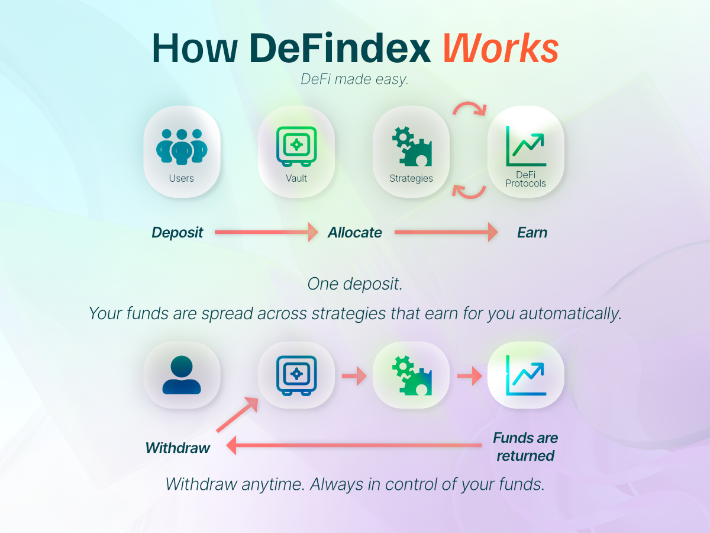

# Welcome

**We are DeFindex** 🔁, a decentralized protocol that makes yield simple and accessible. DeFindex empowers wallet providers, developers, and crypto users to integrate and access a wide range of strategies—bridging DeFi complexity into a plug-and-play solution for yield generation.

### ✨ Why DeFindex?

* **Plug-and-play yield** → no need for deep DeFi expertise.
* **Composable strategies** → support multiple assets and strategies per asset.
* **Secure architecture** → audited, with built-in safeguards like **rebalance** and **rescue** functions.
* **Aligned incentives** → wallets earn whenever their users earn.
* **Future-proof** → easily extend strategies, integrate real-world assets, and unlock new income streams.

<figure><figcaption></figcaption></figure>

#### What will you find here?

* [**API Integration Guide**](api-integration-guide/api.md): Start here! Learn how to integrate DeFindex into your wallet or application. Access our APIs, SDKs, and quickstart guides to enable yield for your users.
* [**Understanding DeFindex**](getting-started/README.md): Core concepts to understand how DeFindex works:
  * [Understanding APY](getting-started/understanding-apy.md) — How yields are calculated
  * [Vault Roles](getting-started/vault-roles.md) — Manager, rebalancer, and fee receiver responsibilities
  * [Partner Fees](getting-started/partner-fees.md) — How the fee model works for partners
* [**SDKs**](advanced-documentation/sdks/README.md): TypeScript and Flutter SDKs for seamless integration.
* [**Postman Collection**](https://drive.google.com/drive/folders/1hp02ySFWFeunRCwiZ6oLCjHzcJXpWhX8?usp=drive_link): Ready-to-use API collection to test and explore DeFindex endpoints.
* [**Smart Contract Development**](strategy-developers/developer-introduction.md): For protocol developers creating new strategies.

If you're new, start with the [**API Integration Guide**](api-integration-guide/api.md) to integrate DeFindex, or explore [**What is DeFindex**](defindex-protocol/what-is-defindex.md) for a detailed overview of the protocol.

With **DeFindex** 🔁, we are offering a secure, efficient, and user-friendly solution to optimize your asset returns.

**DeFi made Easy!**
