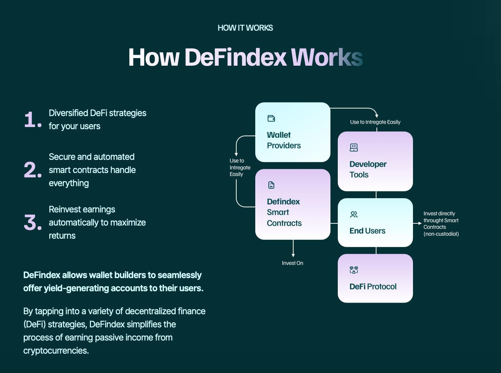

# General/FAQ

DeFindex makes it easy for wallet providers to offer yield-generating accounts to their users through diverse DeFi strategies. It provides seamless integration, security, and transparency, ensuring both developers and users can benefit from passive income and innovative financial tools.

### What is DeFindex?

DeFindex allows wallet providers to integrate automated, secure, and diversified DeFi strategies into their applications, enabling users to earn passive income from cryptocurrencies. It operates through smart contracts, which handle everything from reinvestment to securing funds.

### How can DeFindex benefit wallet builders?

Wallet builders can customize portfolios using a variety of DeFi strategies, enhancing user engagement with yield-generating accounts. DeFindex provides easy integration tools that allow users to start earning with just one click.

### Is DeFindex secure and decentralized?

Yes, DeFindex operates through secure and transparent smart contracts, ensuring that all transactions are decentralized and under the full control of the user, providing peace of mind to partners and users alike.

### How DeFindex works?

<figure><figcaption></figcaption></figure>
