# Media Kit

Official brand assets and design guidelines for DeFindex.

***

## Brand Identity

**Name:** DeFindex (always written with capital "D" and "F")

**Domain:** defindex.io

**Sector:** DeFi (Decentralized Finance) on Stellar/Soroban

**Value Proposition:** Automated savings accounts with diversified DeFi portfolio

**Brand Personality:** Professional, accessible, modern, trustworthy. DeFindex simplifies DeFi for everyone.

### Official Taglines

* "DeFi made easy."
* "Empower your wallet."
* "We grow together."
* "Achieve more with automated DeFi."

### Tone of Voice

* Clear, direct, without unnecessary technical jargon
* Conveys trust and simplicity
* Inclusive: addresses both new and experienced DeFi users
* Never alarmist, never exaggerated hype
* Professional but approachable

***

## Usage Guidelines

* Use assets exactly as provided without modifications
* Maintain safety margin around logos (at least symbol height on each side)
* Minimum logo size: 40px height (digital) / 14mm (print)
* Never rotate, distort, or change opacity
* Never apply logo on backgrounds with insufficient contrast
* For minimal applications (favicons, social avatars), use only the Symbol

***

## DeFindex Symbol

Two intertwined arrows forming a cyclical pattern, representing automated reinvest.

| Light Background                                           | Dark Background                                      | Monochrome                                           |
| ---------------------------------------------------------- | ---------------------------------------------------- | ---------------------------------------------------- |
| 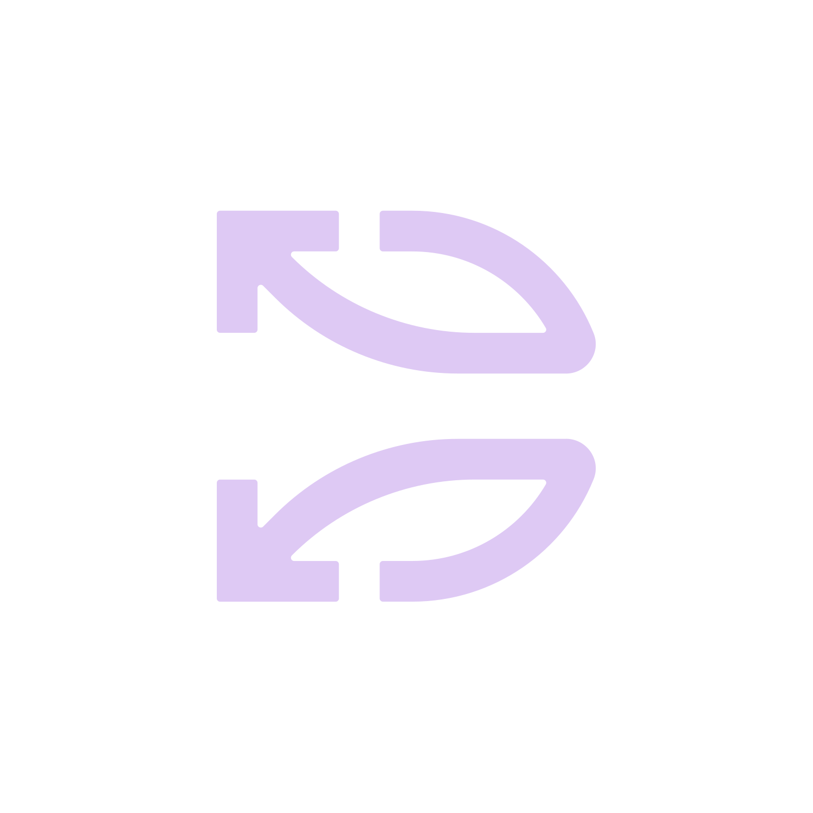 | 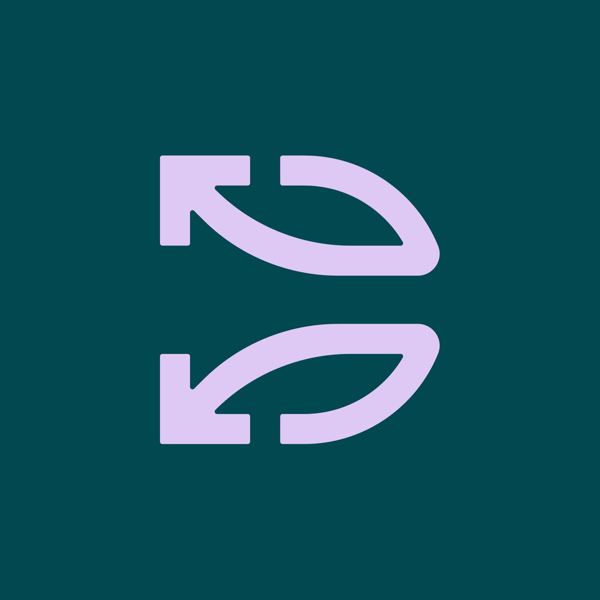 | 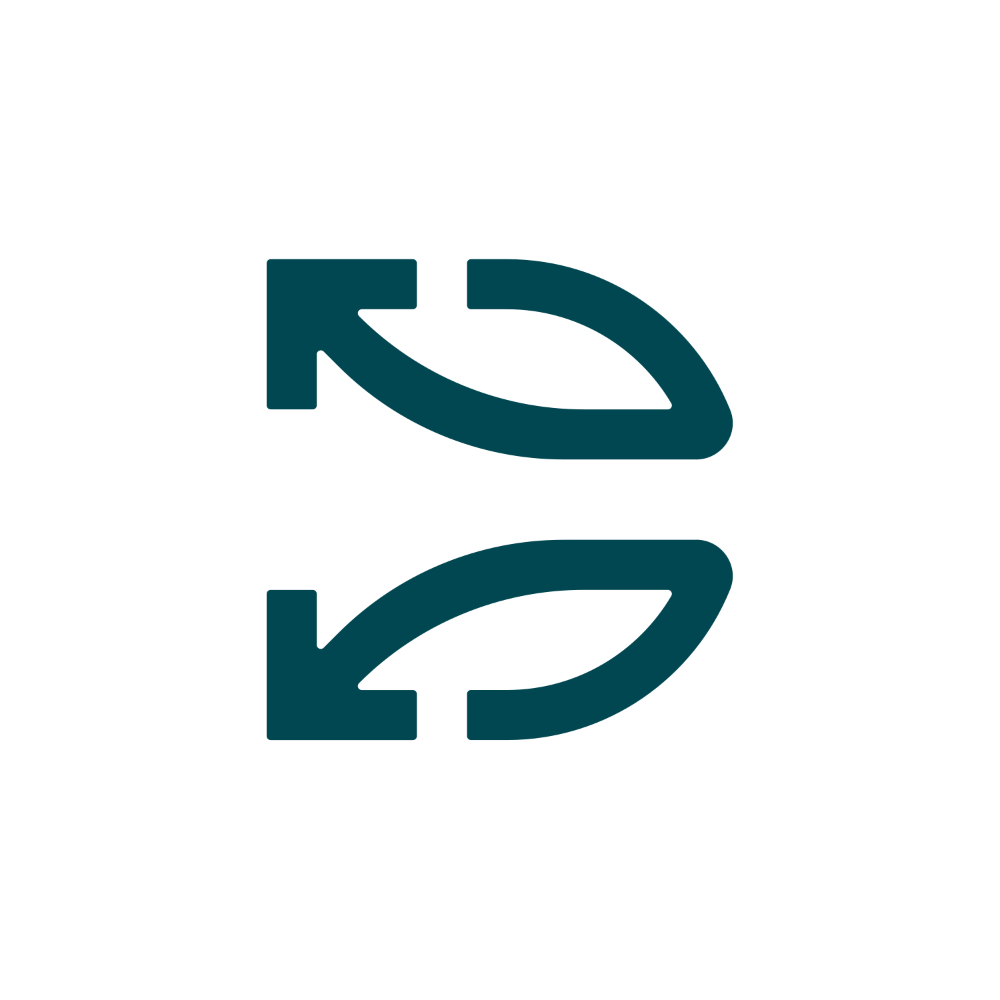 |

***

## DeFindex Logo

Complete signature: Symbol + Wordmark in Familjen Grotesk Bold.

### Horizontal

| Light Background                                                             | Dark Background                                                        | Monochrome                                                             |
| ---------------------------------------------------------------------------- | ---------------------------------------------------------------------- | ---------------------------------------------------------------------- |
| 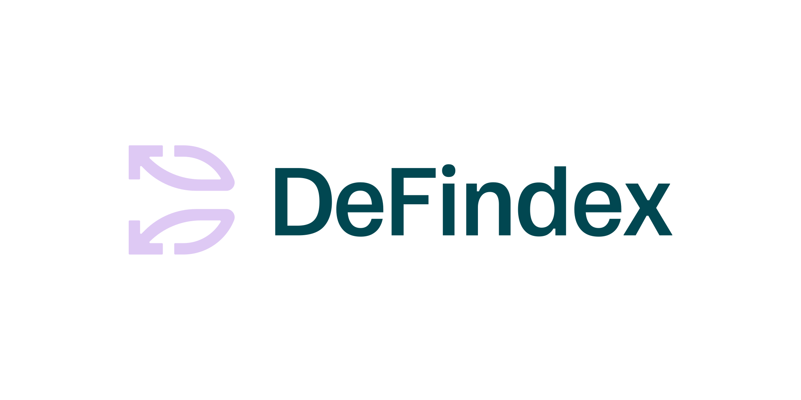 | 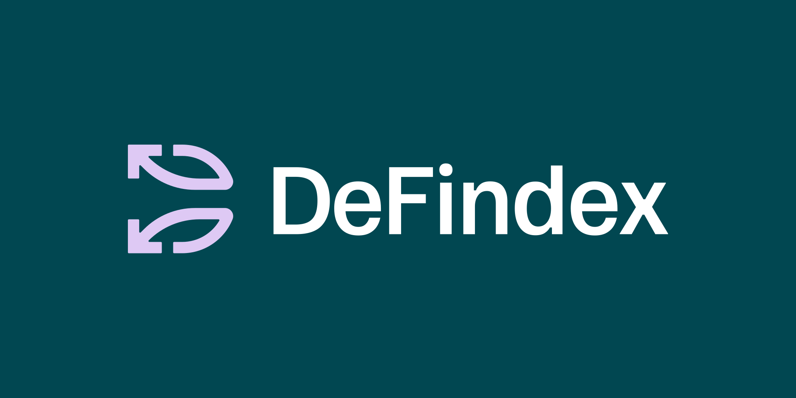 | 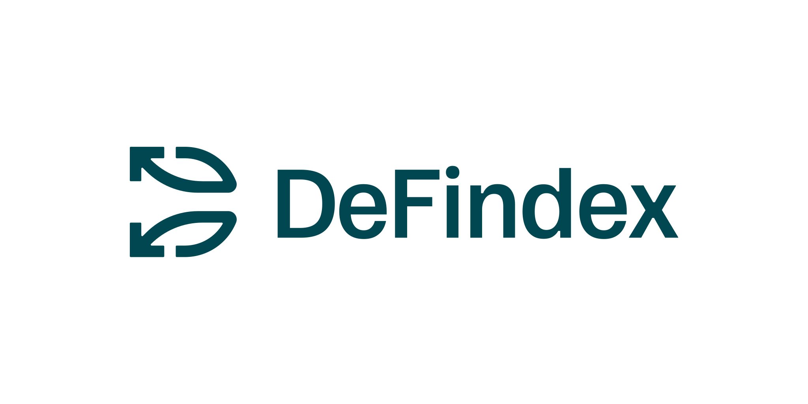 |

### Vertical

| Light Background                                                         | Dark Background                                                    | Monochrome                                                         |
| ------------------------------------------------------------------------ | ------------------------------------------------------------------ | ------------------------------------------------------------------ |
| 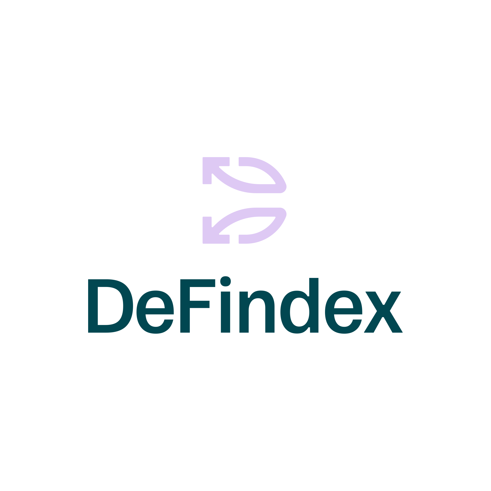 | 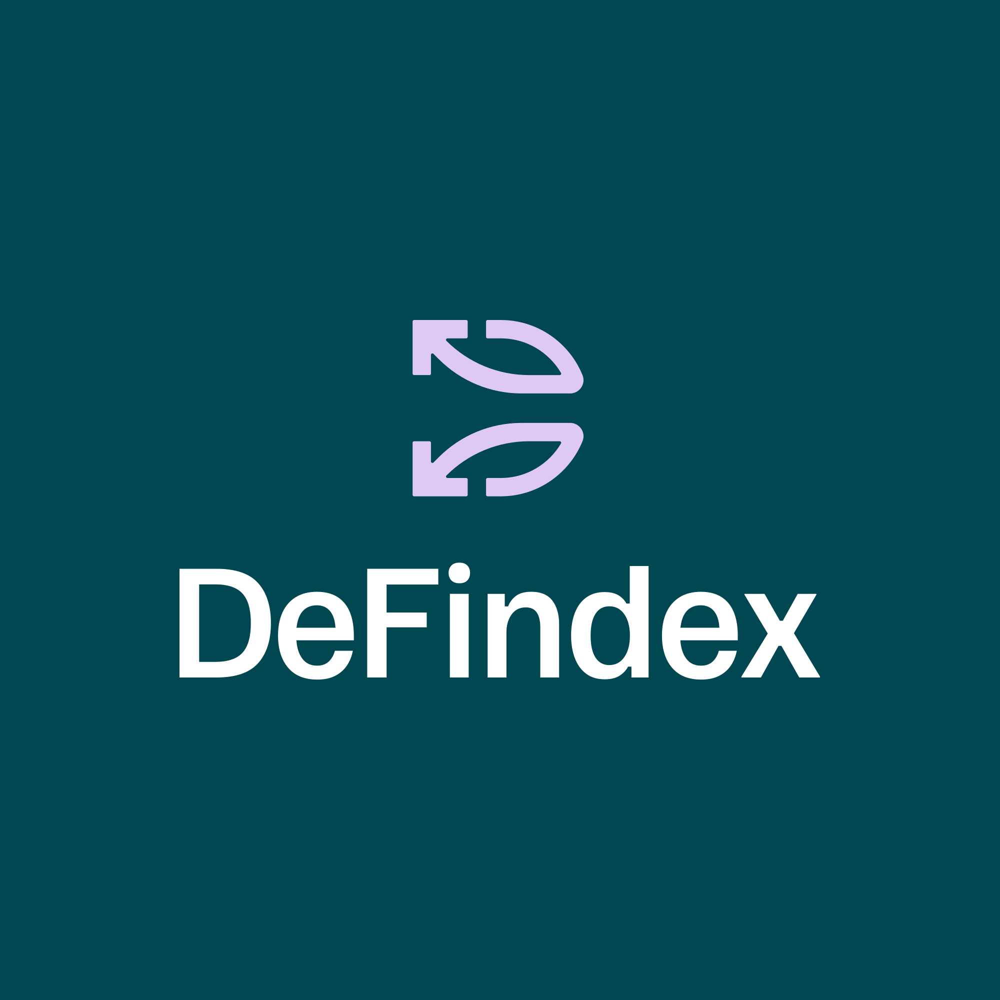 | 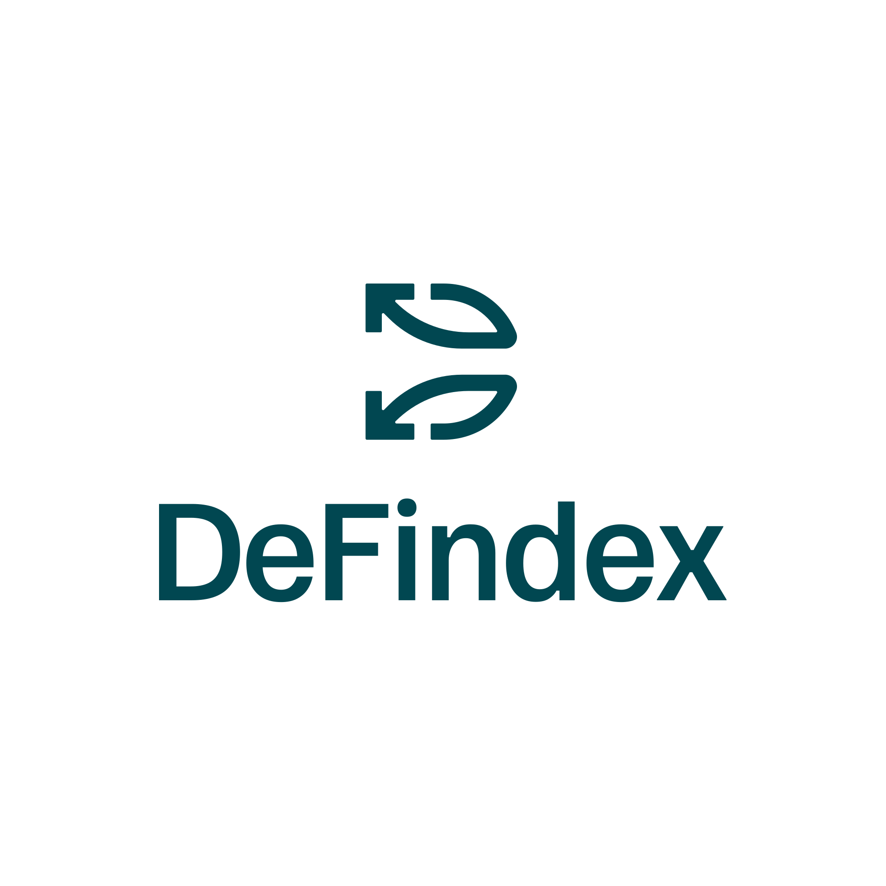 |

### Logo Color Variants

| Context                    | Symbol             | Wordmark             |
| -------------------------- | ------------------ | -------------------- |
| Light background (primary) | Lavender `#DEC9F4` | Dark Green `#014751` |
| Dark background (primary)  | Lavender `#DEC9F4` | White `#FFFFFF`      |
| Monochrome light           | Dark Green         | Dark Green           |
| Monochrome dark            | White              | White                |

***

## Color Palette

| Color           | HEX       | RGB           | Usage                                 |
| --------------- | --------- | ------------- | ------------------------------------- |
| **White**       | `#FFFFFF` | 255, 255, 255 | Light backgrounds, text on dark       |
| **Dark Green**  | `#014751` | 1, 71, 81     | Primary. Titles, text, backgrounds    |
| **Lavender**    | `#DEC9F4` | 221, 201, 244 | Primary. Logo symbol, accents         |
| **Light Green** | `#D3FFB4` | 211, 255, 180 | Accent. Highlights, soft backgrounds  |
| **Light Cyan**  | `#D3FBFF` | 211, 251, 255 | Accent. Backgrounds, graphic elements |
| **Coral**       | `#FC5B31` | 252, 91, 49   | Strong accent. Emphasis, CTAs         |

### Color Usage Rules

* **White, Dark Green, and Lavender** are frequently used: titles, subtitles, descriptive text
* **Light Green, Light Cyan, and Coral** are accent colors: highlights, boxes, buttons
* **Coral** is used for emphasis and keywords in italics within headlines
* Always ensure contrast and legibility
* **Never** use colors outside this palette

***

## Typography

| Font                 | Usage                            | Weights                         |
| -------------------- | -------------------------------- | ------------------------------- |
| **Familjen Grotesk** | Headlines, titles, featured info | Regular, Medium, SemiBold, Bold |
| **Inter Tight**      | Subtitles, body text             | Regular, Medium, SemiBold       |

Both fonts are available on [Google Fonts](https://fonts.google.com/).

### Typography Rules

* Headlines: **Familjen Grotesk** Bold or SemiBold
* Body text: **Inter Tight** Regular or Medium
* Emphasis keyword in headlines: **italic** + **Coral** color
* Maintain clear hierarchy
* Never mix more than 2 font weights in the same piece
* Fallback: `system-ui, -apple-system, "Segoe UI", sans-serif`

***

## Visual Elements

### Glass Elements (3D)

Translucent 3D shapes with glassmorphism aesthetic, colored in **duotone** using brand palette combinations.

|                                              |                                              |                                              |
| -------------------------------------------- | -------------------------------------------- | -------------------------------------------- |
| 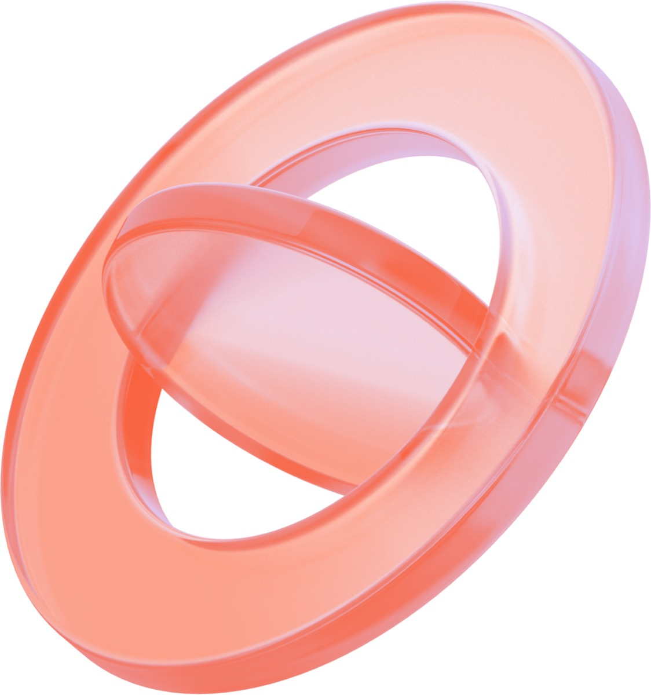 | 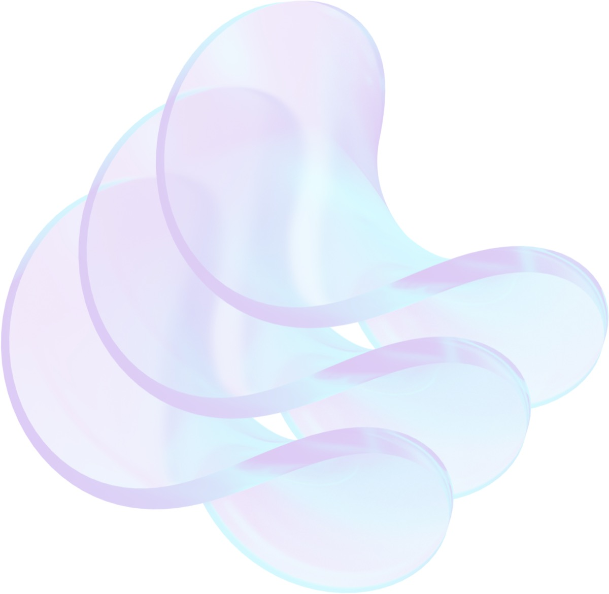 | 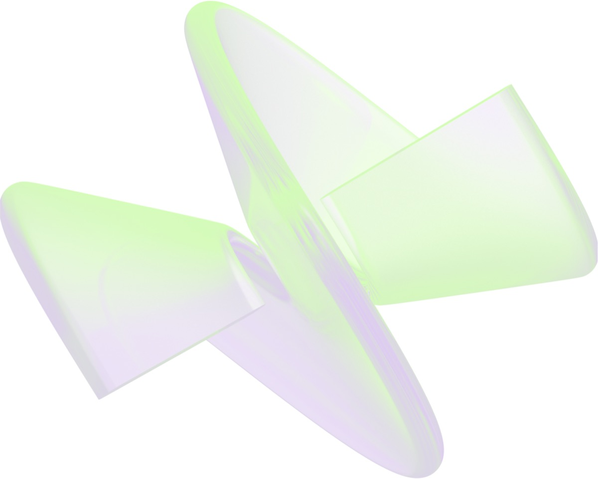 |

**Rules:**

* Always translucent, never solid or opaque
* Types: interlocking tori/rings, crystalline shapes, fluid blobs
* Use combinations like Dark Green + Lavender, Coral + Light Cyan

### Gradients

Soft, diffused gradients using brand palette colors.

|                                                    |                                                    |
| -------------------------------------------------- | -------------------------------------------------- |
|  |  |

**Approved combinations:**

* Cyan → Light Green → Lavender
* Coral → Light Cyan
* Lavender → Coral
* Light Cyan → Lavender
* Light Green → Lavender → Coral

Gradients must be **soft and diffused**, never with abrupt transitions.

***

## Icons

| Vault                                       | Strategies                                            | User                                      | Graph                                                | Group                                                 |
| ------------------------------------------- | ----------------------------------------------------- | ----------------------------------------- | ---------------------------------------------------- | ----------------------------------------------------- |
|  |  |  |  |  |

***

## Do's and Don'ts

### ✅ Do

* Use generous whitespace - the brand breathes
* Prioritize clean backgrounds (white, Dark Green, or soft gradients)
* Use glass 3D elements as hero visuals
* Write "DeFindex" with capital D and F

### ❌ Don't

* Use colors outside the 6-color palette
* Rotate, distort, or alter the logo
* Apply logo as watermark with reduced opacity
* Use aggressive "crypto bro" aesthetic (rockets, moons, diamonds)
* Create visually noisy or saturated compositions
* Create opaque 3D elements - always translucent glass aesthetic
