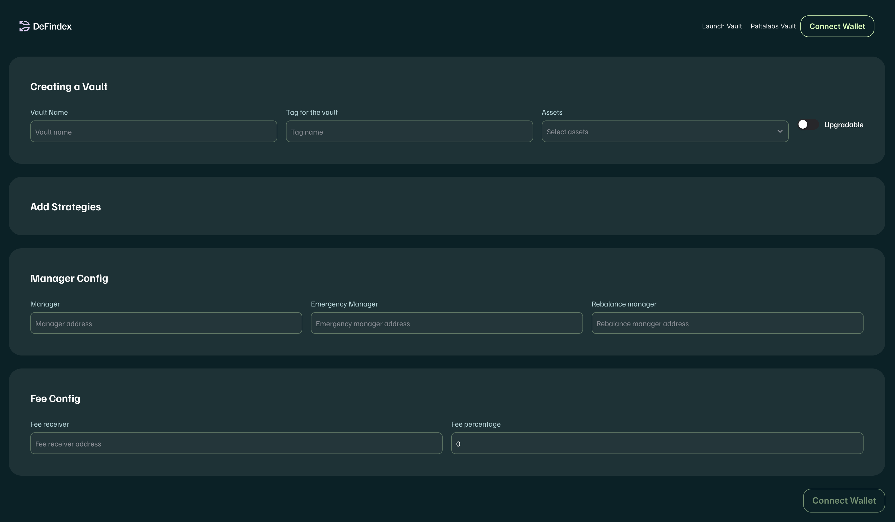

# Create your Rescue Bot with K3

## ¿What is a rescue?

It allows the Emergency Manager to rescue funds in case of an emergency. These are held in the DeFindex Smart Contracts. Thus, the users won't lose their funds and they will be able to withdraw them anytime.

### Emergency Management

The Emergency Manager has the authority to withdraw assets from the DeFindex in case of an emergency. This role is designed to protect users' assets in the event of a critical situation, such as a hack of a underlying protocol or a if a strategy gets unhealthy. The Emergency Manager can withdraw assets from the Strategy and store them as IDLE funds inside the Vault until the situation is resolved.

in code:

```rust
/// Executes rescue (formerly emergency withdrawal) from a specific strategy.
    ///
    /// This function allows the emergency manager or manager to withdraw all assets from a particular strategy
    /// and store them as idle funds within the vault. It also pauses the strategy to prevent further use until
    /// unpaused.
    ///
    /// # Arguments:
    /// * `e` - The environment.
    /// * `strategy_address` - The address of the strategy to withdraw from.
    /// * `caller` - The address initiating the emergency withdrawal (must be the manager or emergency manager).
    ///
    /// # Returns
    /// * `Result<(), ContractError>` - Success (()) or ContractError if the rescue operation fails
    fn rescue(
        e: Env,
        strategy_address: Address,
        caller: Address,
    ) -> Result<(), ContractError> {
        extend_instance_ttl(&e);
```

# K3 solution

To integrate Bot rescue with [K3-labs](https://app.k3-labs.com/)

# Step by step

Create account in k3.
Create in Cubist a wallet.
Charge this wallet.
Create a Vault in defindex with  

You can use this template:

## Deploying a Vault

### GUI (Basic)

If you want to create a vault using the strategies available in DeFindex without writing any code, you can use the DeFindex user interface. Here's how:

1.  **Visit the DeFindex page**: Go to [app.defindex.io](https://app.defindex.io) and navigate to the vault creation section in the DeFindex user interface.
<figure><figcaption></figcaption></figure>
