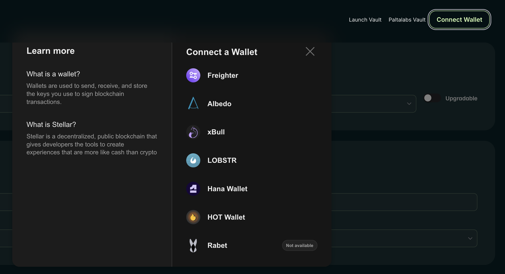
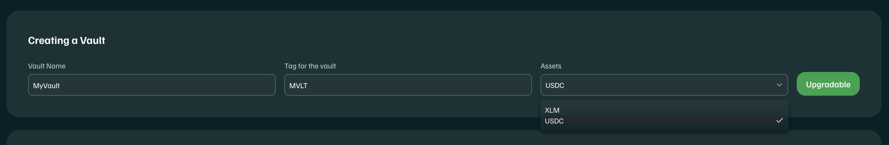
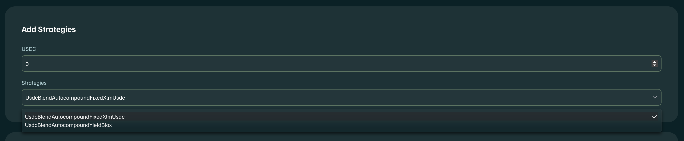
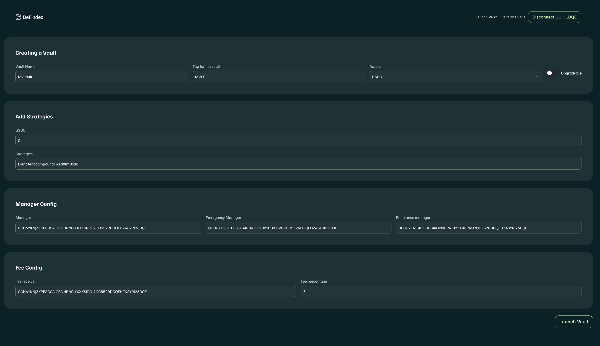
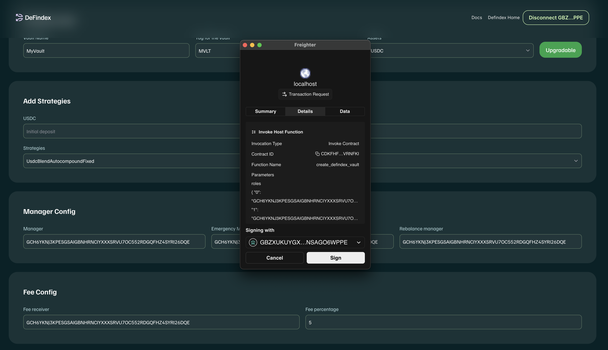
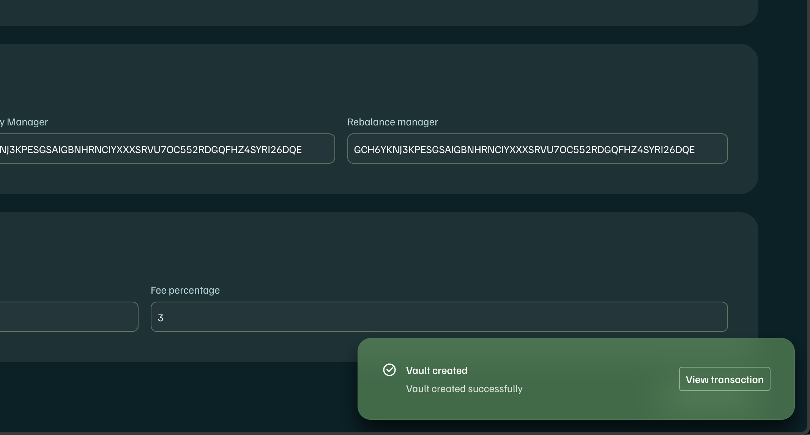

# Using GUI (Basic)

If you want to create a vault using the strategies available in DeFindex without writing any code, you can use the DeFindex user interface. Here's how:

1. **Visit the DeFindex page**: Go to [app.defindex.io](https://app.defindex.io) and navigate to the vault creation section in the DeFindex user interface.

<figure><figcaption></figcaption></figure>

2. **Connect your wallet**: Make sure your wallet is connected to the correct network and that you have the necessary funds to pay for transaction fees.

<figure><figcaption></figcaption></figure>

3. **Complete the vault creation form**: Provide the required information, such as the vault's name, symbol, select the asset you wish to use, and use the switch to choose if you want your vault to be **upgradable**.

<figure><figcaption></figcaption></figure>

1. **Select strategies**: Choose the strategies you want to include in your vault. You can select multiple strategies based on your preferences.

> \[!NOTE]\
> The available strategies you can select will depend on the asset you have chosen for your vault. Only compatible strategies for the selected asset will be displayed.

<figure><figcaption></figcaption></figure>

1. **Configure the remaining fields**: Finish completing the form with the required information, such as manager addresses, fees, and other relevant parameters.

<figure><figcaption></figcaption></figure>

1. **Review and confirm**: Before submitting the transaction, review all the details to ensure everything is correct.

<figure><figcaption></figcaption></figure>

1. **Submit the transaction**: Once you are sure all the information is correct, sign and submit the transaction to create your vault with your wallet.
2. **Wait for confirmation**: After submitting the transaction, wait for it to be confirmed on the blockchain. Once confirmed, your vault will be active, and you can start interacting with it.

<figure><figcaption></figcaption></figure>

\-----

### Interacting with the Factory Contract (Advanced)

If you prefer to interact directly with the DeFindex Factory contract to create a vault, here's a step-by-step guide:

1. **Locate the Factory contract**: Find the DeFindex Factory contract address in the [`~/public/`](https://github.com/paltalabs/defindex/tree/main/public) folder.
2. **Prepare the transaction**: Use your preferred method to prepare a transaction that interacts with the Factory contract. You will need to provide the following parameters:
   * `roles`: A `Map` containing role identifiers (`u32`) and their respective addresses (`Address`). Example: `{1: "GCINP...", 2: "GCINP..."}`.
   * `vault_fee`: The commission rate in basis points (1 basis point = 0.01%). Example: `100` for a 1% fee.
   * `assets`: A vector of [`AssetStrategySet`](../../../contracts/common/src/models.rs) structures that define the strategies and assets managed by the vault.
     *   **Structure of AssetStrategySet**:

         ```rust
         struct AssetStrategySet {
             address: Address,  // The address of the asset (token)
             strategies: Vec<Strategy>,  // A vector of strategies for this asset
         }

         struct Strategy {
             address: Address,  // The address of the strategy contract
             name: String,      // The name of the strategy
             paused: bool,      // Whether the strategy is initially paused
         }
         ```
     *   **Example**:

         ```json
         {
           "address": "CBZ5WXLMCH...",  // USDC token address
           "strategies": [
             {
               "address": "CCIN4WQP5Z...",  // Lending strategy address
               "name": "DummyStrategy",
               "paused": false
             },
             {
               "address": "CD2QVXMN7Y...",  // Yield farming strategy address
               "name": "DummyStrategy2",
               "paused": false
             }
           ]
         }
         ```
   * `soroswap_router`: The address of the Soroswap router (`Address`) that facilitates exchanges within the vault. (You can find the address [here](https://api.soroswap.finance/api/mainnet/router))
   * `name_symbol`: A `Map` containing the name and symbol of the vault. Example: `{"name": "MyVault", "symbol": "MVLT"}`.
   * `upgradable`: A boolean indicating whether the vault contract will support upgrades. Example: `true` or `false`.
3. **Submit the transaction**: Once you have prepared the transaction with the required parameters, sign and send it using your preferred method.
4. **Wait for confirmation**: After submitting the transaction, wait for it to be confirmed on the blockchain. Once confirmed, your vault will be active, and you can start interacting with it.

> \[!NOTE]\
> In order to reduce the complexity of the transaction, and to avoid limit errors on the transaction, we recommend creating the vault with only one asset and max two strategies.

***


###

###
