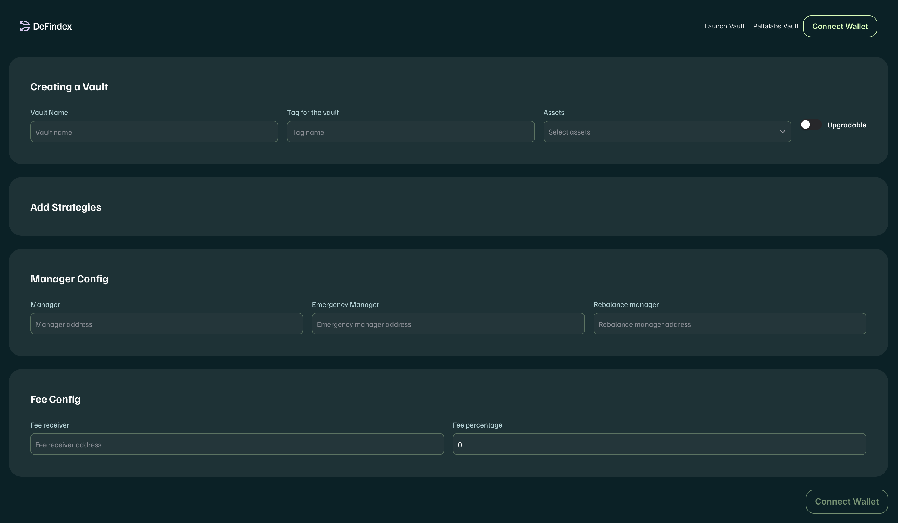
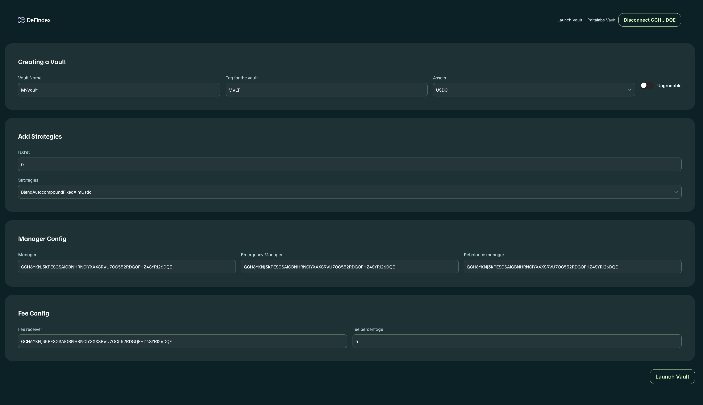
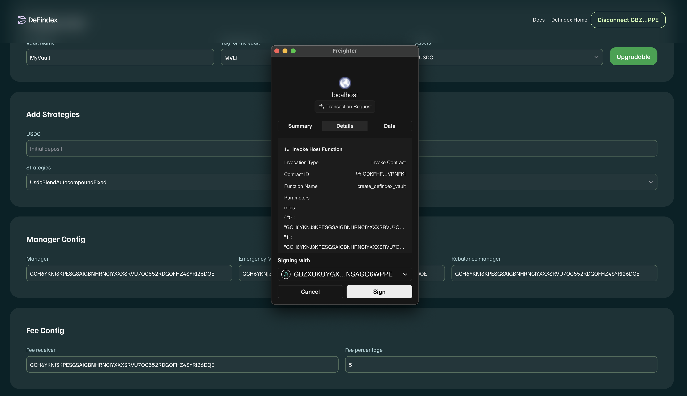

# Integrating DeFindex into Your Wallet

## Prerequisites:

To integrate DeFindex into your wallet, you can choose between two approaches:

1.  **SDKs**: Utilize the SDKs provided by DeFindex, which facilitate interaction with the protocol and are faster to implement.
2.  **Smart Contracts**: Interact directly with DeFindex's smart contracts, giving you greater control over transactions but requiring a deeper understanding of the protocol's structure.

DeFindex is a protocol that allows users to interact with various investment strategies and liquidity pools. To integrate it into your wallet, you need to understand how transactions and the smart contracts that make up the protocol are structured.
For this purpose, you can review the contract addresses in the [`~/public/`](https://github.com/paltalabs/defindex/tree/main/public) folder, where you'll find information about the contract addresses, or deploy your own custom vault and strategies using our Factory contract.

-----

## Deploying a Vault

### GUI (Basic)

If you want to create a vault using the strategies available in DeFindex without writing any code, you can use the DeFindex user interface. Here's how:

1.  **Visit the DeFindex page**: Go to [app.defindex.io](https://app.defindex.io) and navigate to the vault creation section in the DeFindex user interface.
<figure><figcaption></figcaption></figure>
2.  **Connect your wallet**: Make sure your wallet is connected to the correct network and that you have the necessary funds to pay for transaction fees.
<figure><figcaption></figcaption></figure>
3.  **Complete the vault creation form**: Provide the required information, such as the vault's name, symbol, select the asset you wish to use, and use the switch to choose if you want your vault to be **upgradable**.
<figure><figcaption></figcaption></figure>
4.  **Select strategies**: Choose the strategies you want to include in your vault. You can select multiple strategies based on your preferences.
>[!NOTE]
> The available strategies you can select will depend on the asset you have chosen for your vault. Only compatible strategies for the selected asset will be displayed. 
<figure><figcaption></figcaption></figure>
5.  **Configure the remaining fields**: Finish completing the form with the required information, such as manager addresses, fees, and other relevant parameters.
<figure><figcaption></figcaption></figure>

6.  **Review and confirm**: Before submitting the transaction, review all the details to ensure everything is correct.
<figure><figcaption></figcaption></figure>

7.  **Submit the transaction**: Once you are sure all the information is correct, sign and submit the transaction to create your vault with your wallet.

8.  **Wait for confirmation**: After submitting the transaction, wait for it to be confirmed on the blockchain. Once confirmed, your vault will be active, and you can start interacting with it.
<figure><figcaption></figcaption></figure>
-----

### Interacting with the Factory Contract (Advanced)

If you prefer to interact directly with the DeFindex Factory contract to create a vault, here's a step-by-step guide:

1.  **Locate the Factory contract**: Find the DeFindex Factory contract address in the [`~/public/`](https://github.com/paltalabs/defindex/tree/main/public) folder.

2.  **Prepare the transaction**: Use your preferred method to prepare a transaction that interacts with the Factory contract. You will need to provide the following parameters:

      * `roles`: A `Map` containing role identifiers (`u32`) and their respective addresses (`Address`). Example: `{1: "GCINP...", 2: "GCINP..."}`.
      * `vault_fee`: The commission rate in basis points (1 basis point = 0.01%). Example: `100` for a 1% fee.
      * `assets`: A vector of [`AssetStrategySet`](../../contracts/common/src/models.rs) structures that define the strategies and assets managed by the vault.
        * **Structure of AssetStrategySet**:
          ```rust
          struct AssetStrategySet {
              address: Address,  // The address of the asset (token)
              strategies: Vec<Strategy>,  // A vector of strategies for this asset
          }
          
          struct Strategy {
              address: Address,  // The address of the strategy contract
              name: String,      // The name of the strategy
              paused: bool,      // Whether the strategy is initially paused
          }
          ```
        * **Example**:
          ```json
          {
            "address": "CBZ5WXLMCH...",  // USDC token address
            "strategies": [
              {
                "address": "CCIN4WQP5Z...",  // Lending strategy address
                "name": "DummyStrategy",
                "paused": false
              },
              {
                "address": "CD2QVXMN7Y...",  // Yield farming strategy address
                "name": "DummyStrategy2",
                "paused": false
              }
            ]
          }
          ```
      * `soroswap_router`: The address of the Soroswap router (`Address`) that facilitates exchanges within the vault. (You can find the address [here](https://api.soroswap.finance/api/mainnet/router))
      * `name_symbol`: A `Map` containing the name and symbol of the vault. Example: `{"name": "MyVault", "symbol": "MVLT"}`.
      * `upgradable`: A boolean indicating whether the vault contract will support upgrades. Example: `true` or `false`.

3.  **Submit the transaction**: Once you have prepared the transaction with the required parameters, sign and send it using your preferred method.

4.  **Wait for confirmation**: After submitting the transaction, wait for it to be confirmed on the blockchain. Once confirmed, your vault will be active, and you can start interacting with it.

>[!NOTE]
> In order to reduce the complexity of the transaction, and to avoid limit errors on the transaction, we recommend creating the vault with only one asset and max two strategies. 

-----

## Understanding DeFindex Structure

### Roles

**Roles** are unique identifiers that assign specific responsibilities within the vault and are the only entities with privileges to perform critical actions. Each role is associated with an `Address` that represents the entity responsible for that function.

  * **Manager**: 
    - Responsible for managing the vault's strategies and operations.
    - Can change the Emergency Manager and Fee Receiver.
    - Can execute all the methods of the other roles.
    - Can upgrade the vault WASM code if the `upgrade` option was enabled on deploy.
  * **Emergency Manager**: 
    - Responsible for making critical decisions in emergency situations.
    - Can rescue funds in case of an emergency.
    - Can pause or unpause strategies.
  * **Rebalance Manager**: 
    - Responsible for making adjustments to asset allocation within the vault.
    - Can rebalance between strategies to optimize performance and minimize risk.
  * **Fee Receiver**: 
    - Receives fees generated by the vault.
    - Can distribute fees from the vault.

>[!NOTE]
> In order to reduce risks and ensure the security of the vault, it is recommended to set a multisig address as the `Manager` role. This way, multiple parties must approve critical actions, enhancing security and accountability.

If you need more information about the roles, you can check the [Roles](../getting-started/creating-a-defindex-vault.md#core-roles) section at the "getting started" page.

### Fees

**Fees** are percentages in basis points (1 basis point = 0.01%) applied to transactions within the vault. These fees can include:

  * **Vault Fee**: The fee assigned to the `Fee Receiver`.
  * **Defindex Fee**: The fee designated for the DeFindex protocol.

### Upgrade

The **`upgrade`** option allows the vault contract to be upgradable. If enabled (`true`), the contract can change its WASM code without requiring user signatures. This is useful for implementing improvements or correcting errors without interrupting vault operations.

-----

### Interacting with the Vault

Within vault interactions, there are several methods you can use to manage and query the vault's state. Here are the most relevant ones:

**User-facing relevant methods:**

  * **Deposit**: Allows users to deposit assets into the vault.
  * **Withdraw**: Allows users to withdraw assets from the vault.
  * **Balance**: Allows users to query their vault balance.

**Management methods:**

  * **rebalance**: Allows adjusting asset allocation within the vault.
  * **rescue**: Allows recovering assets in critical situations.
  * **set_fees**: Allows managing the fees associated with the vault.
  * **pause / unpause**: Allows pausing or resuming vault operations.

**Methods available only to the `Manager` role:**

  * **set_fee_receiver**: Allows changing the fee receiver of the vault.
  * **set_manager**: Allows changing the manager of the vault.
  * **set_emergency_manager**: Allows changing the emergency manager of the vault.
  * **set_rebalance_manager**: Allows changing the rebalance manager of the vault.
  * **upgrade**: Allows changing the WASM code without requiring users signatures.
  * **lock_fees**: Allows locking the fees in the vault, preventing them from being withdrawn until the lock is released.
  * **release_fees**: Allows releasing the locked fees in the vault, making them available for withdrawal.


You can find the complete list of methods and their parameters in the [Vault contract](../../contracts/vault//src//interface.rs)


### Creating Transactions to Interact with the Vault

#### Deposit

To make a deposit into the vault, use the `deposit` method. Here are the steps to create the transaction:

1.  **Prepare parameters**:

      * `amounts_desired`: A vector specifying the desired quantities of each asset you wish to deposit.
      * `amounts_min`: A vector specifying the minimum quantities of each asset to be transferred from the source for each asset.
      * `from`: The address of the user making the deposit. Represents a Soroban address.
      * `invest`: A boolean indicating whether the deposited funds should be automatically invested in the vault's strategies (`true`) or remain as idle\_funds (`false`).

2.  **Example transaction**:

    ```json
    {
      "method": "deposit",
      "params": {
        "amounts_desired": [1000],
        "amounts_min": [900],
        "from": "GCINP...",
        "invest": true
      }
    }
    ```

-----

#### Withdraw

To withdraw assets from the vault, use the `withdraw` method. Here are the steps to create the transaction:

1.  **Prepare parameters**:

      * `withdraw_shares`: The amount of vault shares you wish to withdraw.
      * `min_amounts_out`: A vector specifying the minimum amounts required to receive before the transaction fails (tolerance). This amount is represented in underlying assets.
      * `from`: The address of the user performing the withdrawal, who will receive the funds. Represents a Soroban address.

2.  **Example transaction**:

    ```json
    {
      "method": "withdraw",
      "params": {
        "withdraw_shares": 500,
        "min_amounts_out": [450],
        "from": "GCINP..."
      }
    }
    ```

-----

#### Balance

To query the vault's balance, use the `balance` method. Here are the steps to create the transaction:

1.  **Prepare parameters**:

      * `from`: The address of the user who wants to query the balance. Represents a Soroban address.

2.  **Example transaction**:

    ```json
    {
      "method": "balance",
      "params": {
        "from": "GCINP..."
      }
    }
    ```

-----

#### Rebalance

To adjust asset allocation within the vault, use the `rebalance` method. Here are the steps to create the transaction:

1.  **Prepare parameters**:

      * `caller`: The address of the user performing the rebalance.

2.  **Example transaction**:

    ```json
    {
      "method": "rebalance",
      "params": {
        "caller": "GCINP..."
      }
    }
    ```

-----

#### Rescue

To recover assets in critical situations, use the `rescue` method. Here are the steps to create the transaction:

1.  **Prepare parameters**:

      * `strategy_address`: The address of the strategy from which you want to recover assets. This must be a valid address of a strategy linked to the vault.
      * `caller`: The address of the user performing the rescue operation.

2.  **Example transaction**:

    ```json
    {
      "method": "rescue",
      "params": {
        "strategy_address": "GCINP...",
        "caller": "GCINP..."
      }
    }
    ```

-----

#### Pause / Unpause

To pause or unpause a strategy, use the `pause_strategy` and `unpause_strategy` methods. Here are the steps to create the transactions:

1.  **Prepare parameters**:

      * `strategy_address`: The address of the strategy you want to pause or unpause.
      * `caller`: The address of the user performing the operation.

2.  **Example transaction for pausing**:

    ```json
    {
      "method": "pause_strategy",
      "params": {
        "strategy_address": "GCINP...",
        "caller": "GCINP..."
      }
    }
    ```

3.  **Example transaction for unpausing**:

    ```json
    {
      "method": "unpause_strategy",
      "params": {
        "strategy_address": "GCINP...",
        "caller": "GCINP..."
      }
    }
    ```

-----

#### Upgrade

To update the vault's WASM code, use the `upgrade` method. Here are the steps to create the transaction:

1.  **Prepare parameters**:

      * `new_wasm_hash`: The hash of the new WASM code.
      * `caller`: The address of the user performing the upgrade.

2.  **Example transaction**:

    ```json
    {
      "method": "upgrade",
      "params": {
        "new_wasm_hash": "HASH...",
        "caller": "GCINP..."
      }
    }
    ```

-----

If you need a solution out of the box, you can use the DeFindex SDKs, which provide a set of functions to interact with the vault and strategies without having to manually create transactions. The SDKs handle the underlying complexities and allow you to focus on building your wallet's user interface and experience.

